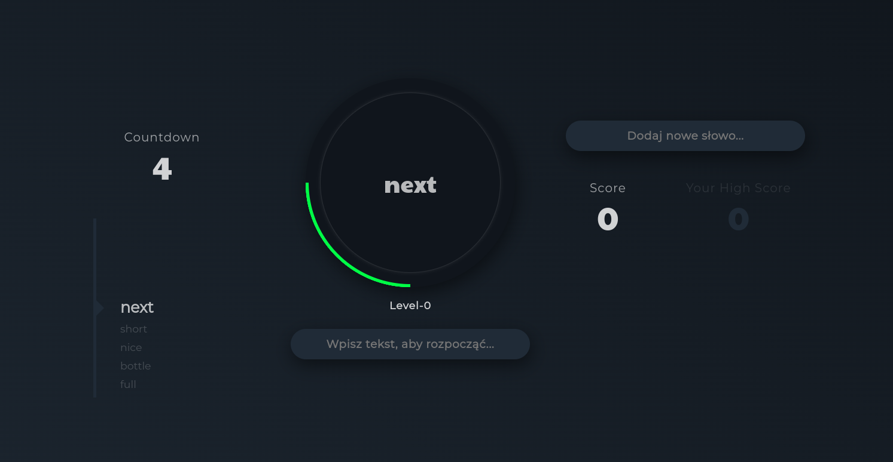

# Speed Typing Simple HTML Game

This project is a simple HTML game designed to test and improve typing speed.

## Table of Contents

- [Speed Typing Simple HTML Game](#speed-typing-simple-html-game)
  - [Table of Contents](#table-of-contents)
  - [Installation](#installation)
  - [Usage](#usage)
  - [Contributing](#contributing)
  - [License](#license)
  - [Screenshots](#screenshots)

## Installation

Clone the repository or download the ZIP file. Then, open the `index.html` file in your web browser.

## Usage

Start the game by opening the `index.html` file in your web browser. Type the displayed words or sentences as fast and accurately as you can.

## Contributing

Contributions are welcome! If you find any issues or want to add new features, feel free to open an issue or submit a pull request.

## License

This project is licensed under the [MIT License](LICENSE).

Language english / polish.

## Screenshots

